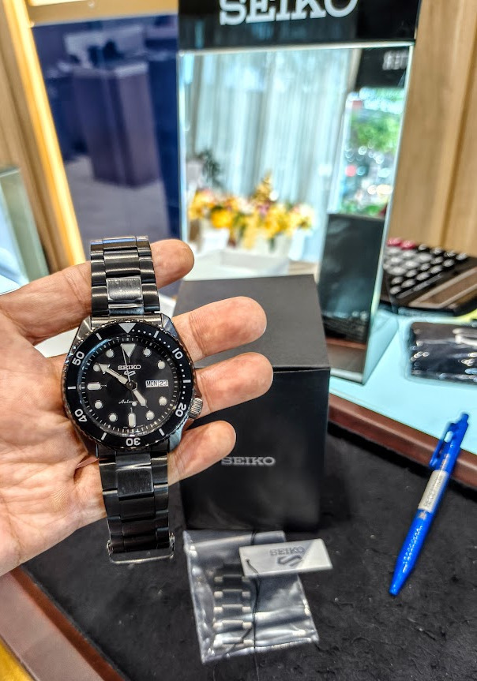
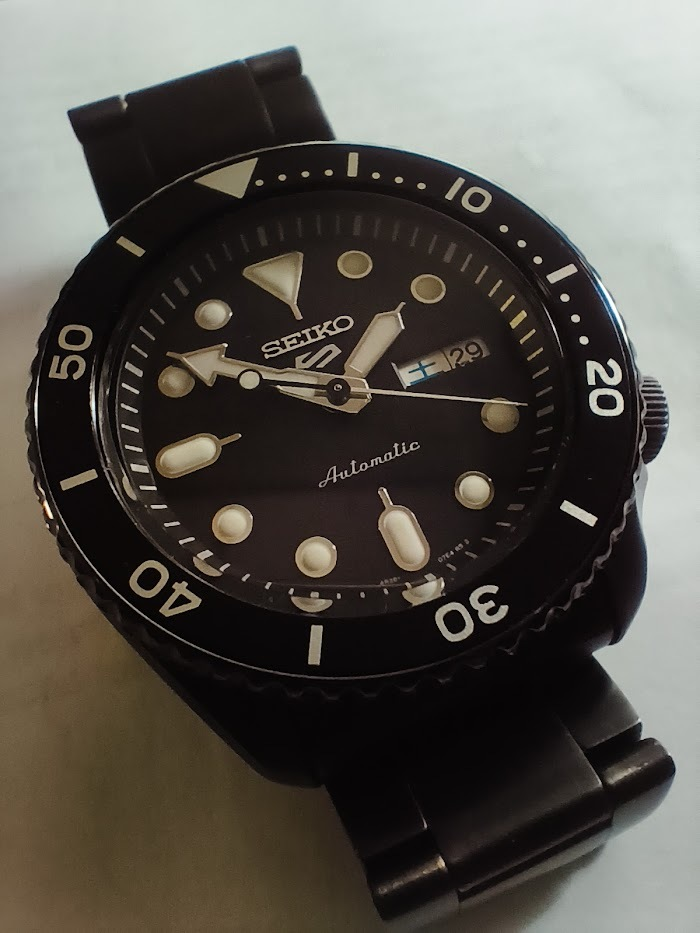
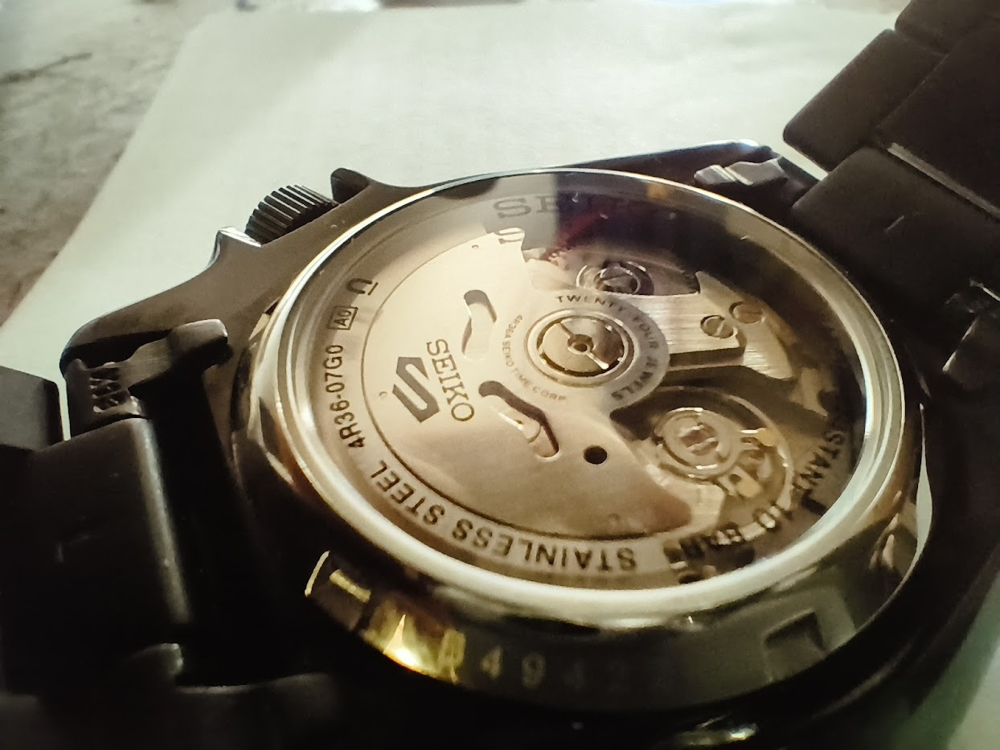

腕時計をしなくてはいけない場面が発生してきそうなのでSEIKO一択でしばらく物色していたが、ピンと来るモデルがあったので、百貨店ではなくあえてSEIKOのサービスセンターに行って買った。

モデル名はSRPD65K　(末尾Kはマレーシア組み立てか) 

ムーブメントは 4R36  
りゅうずはネジロックではない。  
りゅうず0段(押し込み状態)で右回しゼンマイ巻き  
りゅうず1段引き　+左回しで曜日　+右回しで日付  
りゅうず2段引きで秒針ロック (左回し・右回しで時刻合わせ)  
[取扱説明書- SEIKO](https://www.seikowatches.com/instructions/html/SEIKO_4R35_4R36_4R37_4R38_4R39_4R71_4R72_JP/index)  
製品仕様では「日差　＋45秒～－35秒」とあるが、ほぼ24時間腕につけて一週間過ごしてみての「週差」は +20秒だったので日差+3秒くらいか。ひきつづき観察して月でどれくらいズレるか。
