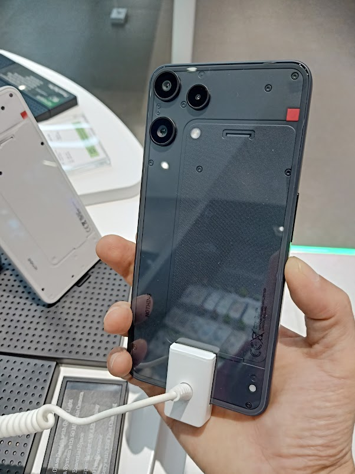

6年も使った旧スマホ(すでにメーカーサポート終了)。バッテリ持ちが悪くなり、電源ボタンも反応しなくなり、肝心なときに立ち上げられなくなったので、とうとう新しいスマホを買うことに。

ちょうどこれからのAI投資で半導体不足が予想されるので、いますでに販売されている割安製品であればよいじゃろう。これで7,999バーツ(約40,000円@THBJPY4.99)。

カメラにもこだわりなく、低スペックでも長く使えれば良い派。  
肝心なOSアップデート保証はAndroid 18まで、セキュリティーアップデートは2031年後半まで、ということなので、これであと約6年間はスマホ買わなくて済む。
