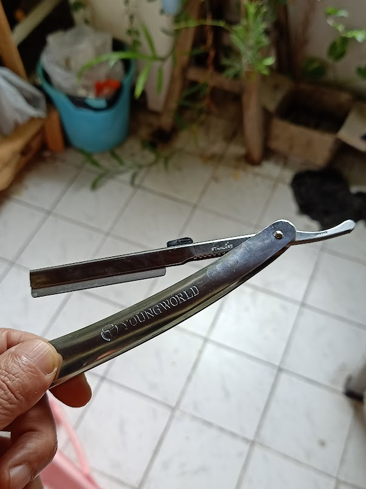
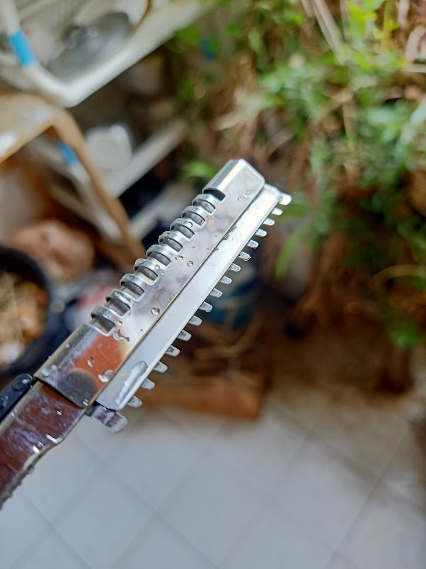
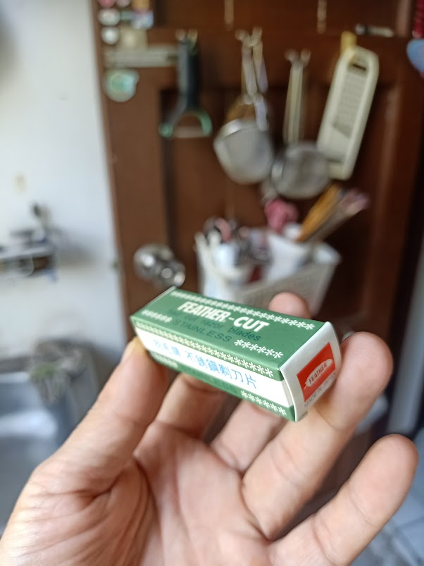

長年ジレットのT字3枚刃ひげそりを使ってきたのだが…。年々替刃の価格が上がってきて、とうとう最近替刃単価100バーツ(約500円!)くらいになってきてしまったので馬鹿馬鹿しくなり、ひげ剃りくらい安くやらせてほしいということで、昔ながらのものを探して買ってきた。

ホルダーと安全ガードがセットで200バーツ、替刃12枚で80バーツ。  

最初この安全ガードの意味が分からず、「なんじゃこのスキバサミのような金具は、要らん!」と裸の刃を肌に当てて血だらけになって「こりゃ素人には無理だ!」と数ヶ月放置していたのだが、あとになってこの安全ガードを付けて剃ればいいのだと理解した。  

安全カードがあるために深剃りは出来ないのだが、安全ガードの厚みをヤスッたりして調整すればもっと深剃りになるかもしれない。  

これでようやくジレットの呪縛から開放された。あばよ。

