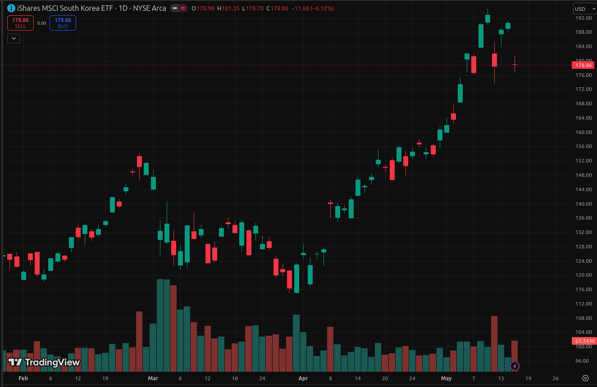

---
title: "EWY"
description: "初の短期トレード"
date: "2026-04-09"
---
メモリ高騰のことはずっと意識していたが資金が定期預金とシンガポール国債に捕まってて動かせなかった。
定期預金が満期になったので引き出し、EWYに連動するファンドを購入。今回はフィーダーファンドを経由してアクセスし、目標リターンを得たら短期で抜けるという計画。

## 4月8日
銀行で定期預金を解約し、スマホアプリのファンドの買い方を教わった。

## 4月9日
翌日普通預金の残高が減っていて「ん??」と思ってファンドの画面を見たら「Proccesing」となっていた。昨日間違って発注ボタンを押してしまったようだ。偶発的とはいえ迷わず突っ込んだことになり、結果的には良かった。
この日のEWY終値139.29ドル。ここがエントリーポイント。

## 4月10~22日
今回の短期トレードの目標リターンは最低でも10%。買値の139.29 * 1.10 = 152.60以上になったら売る、ということです。(しかしこの低い目標値があとで苦い思いを生む)
この間相場の方はホルムズ海峡がどうなるこうなるで毎日上がったり下がったりの荒波でハラハラする。それでも徐々に下値を切り上げていく。

## 4月23以降
23日はハイニックスの決算日。終値150.59で最初の売却。想定利益分を先出し。  
決算で跳ねると思ったが全然だった。  
以降150ドルは下回らないと踏んで毎日分散売却していく。  
 24日　154.57  
 27日　156.73  
 28日　154.37  
 29日　153.96 (売却終了)  
リターンは10.5%　ピッタリ目標値。

## 4月30日以降
サムスン決算。終値160.76。ここからさらに上がっていく。
結局いまのところの最高値は192.85ドル。仮にここで売ったら38%のリターン。
最高値でなくとも180くらいで売っていれば…(後悔)

## まとめ
意図しないタイミングで軍資金一括投入してしまったが、勝ててよかった。ファンドなので毎日15:30のカットオフタイムまでにその日のEWY終値を予測して買売発注しなくてはならないのが、良い訓練になった。  
目標リターンが10%というのは、結果的にあまりに低すぎたわけだが、最初の短期トレードということもあり、欲をかかずに自分で決めたラインで利確できたという体験が必要だった。
もし今回まぐれ的に30%とか4のリターンを得ていたら、次回以降に悪影響が出たかも知れない。堅実に出来たので良かったと思う。  
今後の課題としては米国のETFを夜間に直接取引できる環境を作ることか。そうなったら眠る時間がなくなるけど(笑)。

