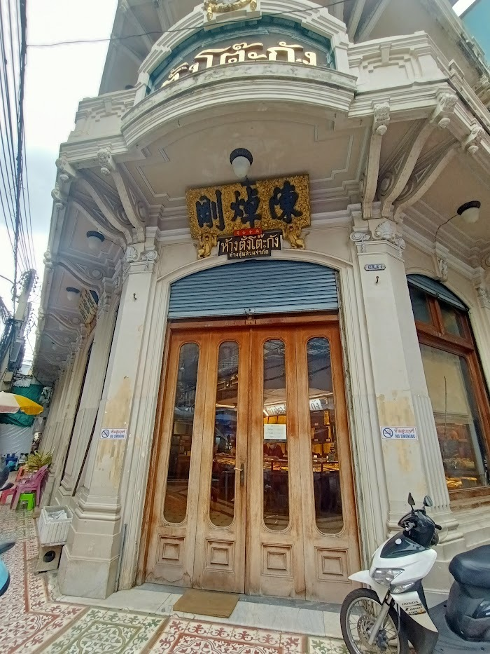
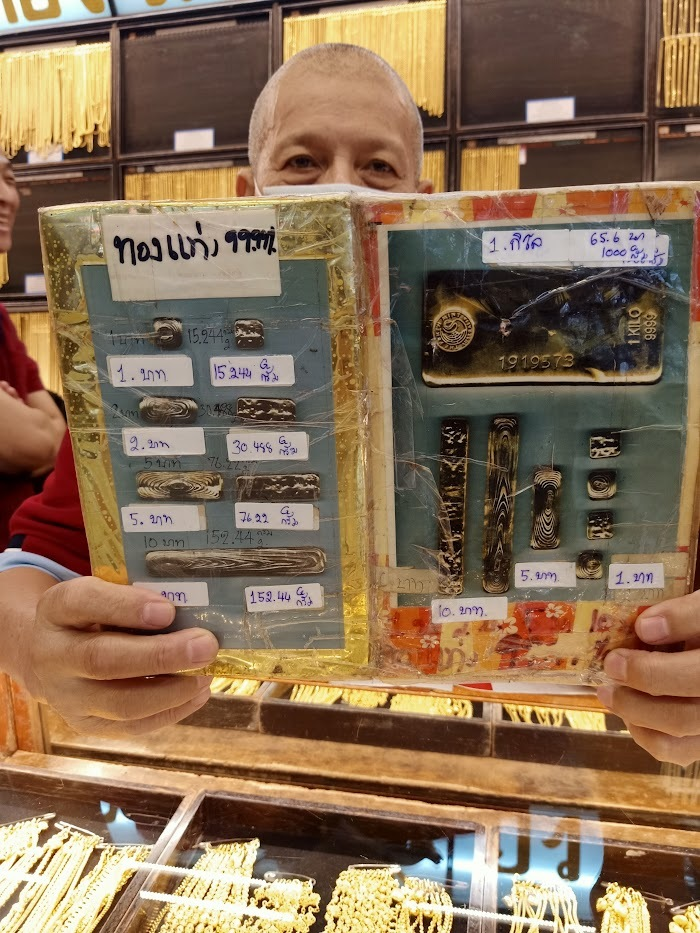

ヤワラー(バンコクの中華街)にある「金行」。  

最初に訪れたのは2023年8月。  

<small>*このおじちゃんは有名人だから目隠しなしで。</small>

タイで売買されている金製品は純度96.5%が一般的ですが、99.9%ゴールドもあることはある。  
重量についてはタイ独自の重量単位「バーツ บาท」およびその1/4の補助単位「サルン สลึง」が使われる。  
1バーツは約15.244グラムとされており、これは1トロイオンスの0.49倍となる (1トロイオンス=31.103グラム)。  

この写真を撮った訪問時は1バーツ重=約33,000฿でした。  
買っておけば今は2倍以上…くっ(悔)  

今後ゴールドが暴落することがあれば、まず現物金を1バーツ重買いたいと思います。  
手元にあって、触っていられる純金というのを持ってみたい。

