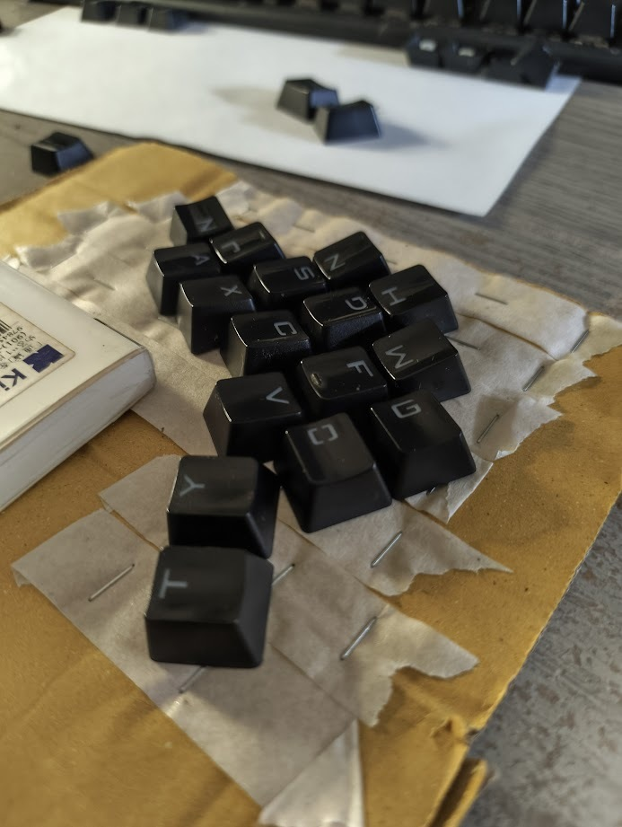
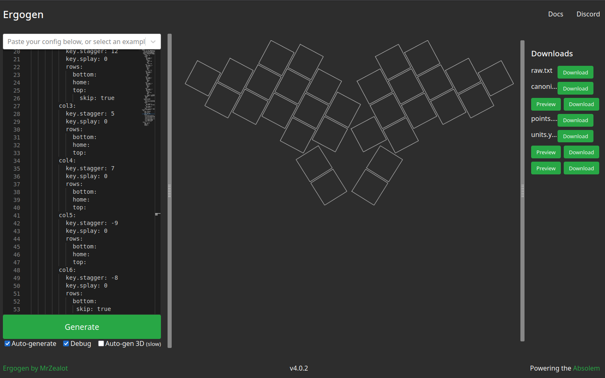

いままで長年放置してきた問題にようやく取り組もう。 
自分の手に合った最小キー数のキーボードを自作するというプロジェクト。

## キーの配置
まず、自分の指が自然に動ける範囲というのはどれくらいのもんなんだろうか。キーキャップを並べて実際に指を置いてみてあれこれ動かして試行錯誤する。動かしたキーキャップの位置を保存できるように両面テープで設計ボードにしてある(アナログ手法)。

左手15キー。右手は14キー+トラックポイント。(トラックポイント含め左右とも15で全30) 
これで大西配列にする(少し変えるが)。 
試作のために3Dプリンターを買うかもしれない。 
ゆくゆくは完全オーダーメイドのキーボードメーカーとして看板を揚げるつもり(老後の収入源)。
